# RutaIA - Plataforma Inteligente de Orientación y Recomendación Académica

## Integrantes del Proyecto

- Fray Emilio Garcia
- Miguel Anyelo Pabon
- Joseph Guilliani Garcia

---

## 1. Descripción de la Problemática y Solución Propuesta

### Problemática
Las instituciones de educación técnica y superior ofrecen catálogos formativos extensos que abarcan programación, desarrollo web, bases de datos, inteligencia artificial, infraestructura y análisis de datos. Sin embargo, los estudiantes a menudo experimentan desorientación académica al intentar elegir una ruta formativa que se ajuste a sus conocimientos previos, expectativas laborales y objetivos personales. 

Los motores de búsqueda convencionales, limitados a coincidencias literales de palabras clave (keyword matching), fracasan cuando la consulta del estudiante no contiene los términos exactos presentes en el título del curso. Por ejemplo, una consulta como *"deseo construir aplicaciones en la nube usando contenedores"* puede no arrojar resultados si el curso se titula *"Despliegue de Microservicios con Docker"*.

### Solución Propuesta
RutaIA es una solución web integral que implementa un pipeline sincrónico de Generación Aumentada por Recuperación (RAG, Retrieval-Augmented Generation). Combina:
- Un backend robusto en Spring Boot 3 con seguridad basada en tokens JWT.
- Una base de datos relacional (MySQL 8) para la persistencia transaccional de usuarios, cursos, consultas, recomendaciones y calificaciones.
- Una base de datos vectorial (Qdrant) que indexa el contenido semántico de los cursos utilizando representaciones densas de 1536 dimensiones (`text-embedding-3-small`).
- Un motor de orquestación (n8n) que coordina la vectorización, la búsqueda semántica con filtro de cursos activos y la síntesis pedagógica con modelos de lenguaje masivo (LLM) vía OpenRouter.
- Una interfaz web (SPA) reactiva y accesible que permite a los estudiantes consultar en lenguaje natural, inspeccionar los cursos fuente con su nivel de afinidad semántica y evaluar la pertinencia de las respuestas.

---

## 2. Tecnologías y Arquitectura

### Stack Tecnológico

- **Backend:** Java 17, Spring Boot 3.5.0, Spring Security 6 (Autenticación sin estado con JJWT 0.12.6), Spring Data JPA, Hibernate, OpenAPI 3 (Swagger UI).
- **Base de Datos Relacional:** MySQL 8.0 (InnoDB, UTF-8mb4).
- **Base de Datos Vectorial:** Qdrant (Búsqueda vectorial con métrica de similitud coseno, vector size 1536, umbral >= 0.45).
- **Orquestación y Automatización:** n8n (Webhooks sincrónicos para RAG y asincrónicos para sincronización de cursos).
- **Modelos de Inteligencia Artificial (OpenRouter):**
  - Generación de Embeddings: `text-embedding-3-small` (1536 dimensiones).
  - Generación de Respuestas: `openai/gpt-oss-20b` (parámetro de temperatura: 0.3).
- **Frontend:** Vanilla JavaScript (ES6+), HTML5 semántico, CSS3 con variables personalizadas, almacenamiento seguro de sesión en `localStorage`.

### Diagrama de Arquitectura del Sistema

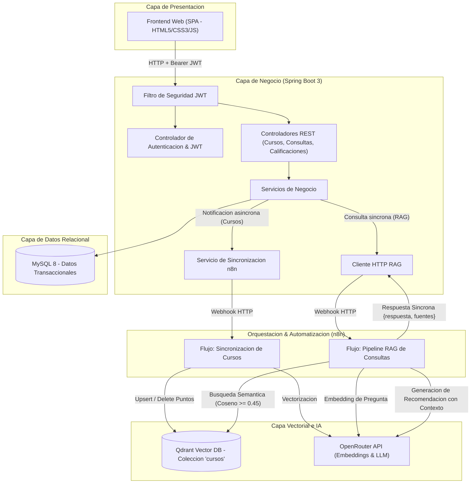
```mermaid
flowchart TD
    subgraph Cliente["Capa de Presentacion"]
        UI["Frontend Web (SPA - HTML5/CSS3/JS)"]
    end

    subgraph Backend["Capa de Negocio (Spring Boot 3)"]
        AUTH["Controlador de Autenticacion & JWT"]
        API["Controladores REST (Cursos, Consultas, Calificaciones)"]
        SVC["Servicios de Negocio"]
        SEC["Filtro de Seguridad JWT"]
        SYNC["Servicio de Sincronizacion n8n"]
        RAG_CLIENT["Cliente HTTP RAG"]
    end

    subgraph Persistencia["Capa de Datos Relacional"]
        DB[(MySQL 8 - Datos Transaccionales)]
    end

    subgraph Orquestacion["Orquestacion & Automatizacion (n8n)"]
        W_SYNC["Flujo: Sincronizacion de Cursos"]
        W_RAG["Flujo: Pipeline RAG de Consultas"]
    end

    subgraph InteligenciaArtificial["Capa Vectorial e IA"]
        QDRANT[(Qdrant Vector DB - Coleccion 'cursos')]
        OPENROUTER["OpenRouter API (Embeddings & LLM)"]
    end

    UI -->|"HTTP + Bearer JWT"| SEC
    SEC --> AUTH
    SEC --> API
    API --> SVC
    SVC --> DB
    SVC -->|"Notificacion asincrona (Cursos)"| SYNC
    SVC -->|"Consulta sincrona (RAG)"| RAG_CLIENT
    SYNC -->|"Webhook HTTP"| W_SYNC
    RAG_CLIENT -->|"Webhook HTTP"| W_RAG
    W_SYNC -->|"Vectorizacion"| OPENROUTER
    W_SYNC -->|"Upsert / Delete Puntos"| QDRANT
    W_RAG -->|"Embedding de Pregunta"| OPENROUTER
    W_RAG -->|"Busqueda Semantica (Coseno >= 0.45)"| QDRANT
    W_RAG -->|"Generacion de Recomendacion con Contexto"| OPENROUTER
    W_RAG -->|"Respuesta Sincrona {respuesta, fuentes}"| RAG_CLIENT
```

### Diagrama del Modelo Entidad-Relación

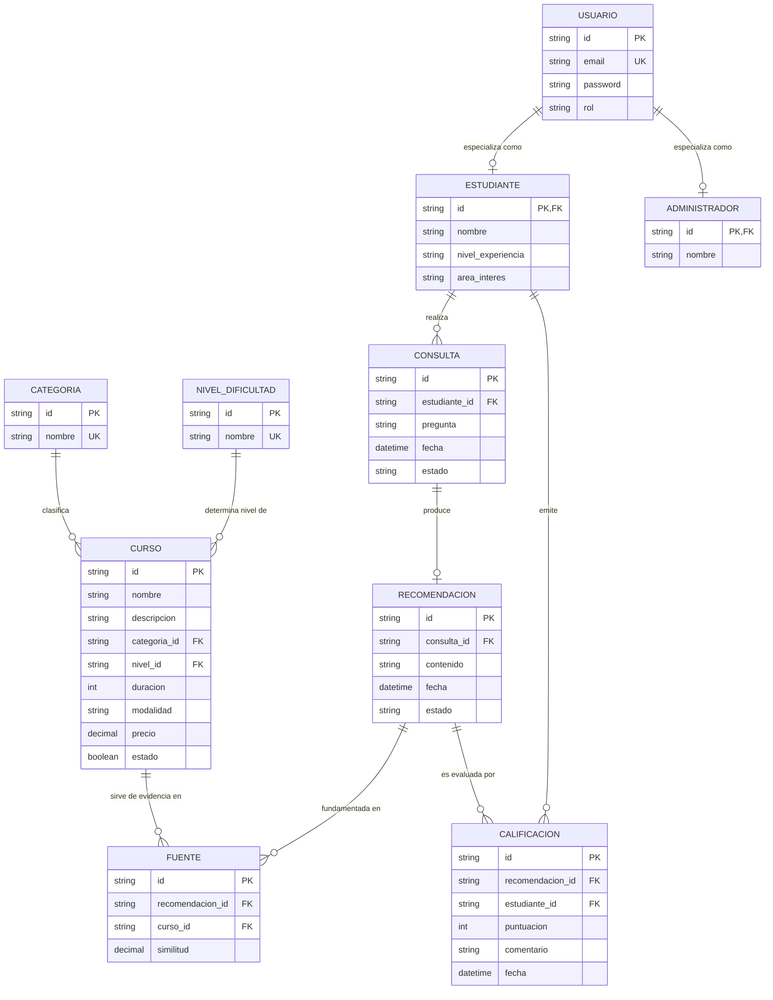
```mermaid
erDiagram
    USUARIO ||--o| ESTUDIANTE : "especializa como"
    USUARIO ||--o| ADMINISTRADOR : "especializa como"
    CATEGORIA ||--o{ CURSO : "clasifica"
    NIVEL_DIFICULTAD ||--o{ CURSO : "determina nivel de"
    ESTUDIANTE ||--o{ CONSULTA : "realiza"
    CONSULTA ||--o| RECOMENDACION : "produce"
    RECOMENDACION ||--o{ FUENTE : "fundamentada en"
    CURSO ||--o{ FUENTE : "sirve de evidencia en"
    RECOMENDACION ||--o{ CALIFICACION : "es evaluada por"
    ESTUDIANTE ||--o{ CALIFICACION : "emite"

    USUARIO {
        string id PK
        string email UK
        string password
        string rol
    }

    ESTUDIANTE {
        string id PK,FK
        string nombre
        string nivel_experiencia
        string area_interes
    }

    ADMINISTRADOR {
        string id PK,FK
        string nombre
    }

    CATEGORIA {
        string id PK
        string nombre UK
    }

    NIVEL_DIFICULTAD {
        string id PK
        string nombre UK
    }

    CURSO {
        string id PK
        string nombre
        string descripcion
        string categoria_id FK
        string nivel_id FK
        int duracion
        string modalidad
        decimal precio
        boolean estado
    }

    CONSULTA {
        string id PK
        string estudiante_id FK
        string pregunta
        datetime fecha
        string estado
    }

    RECOMENDACION {
        string id PK
        string consulta_id FK
        string contenido
        datetime fecha
        string estado
    }

    FUENTE {
        string id PK
        string recomendacion_id FK
        string curso_id FK
        decimal similitud
    }

    CALIFICACION {
        string id PK
        string recomendacion_id FK
        string estudiante_id FK
        int puntuacion
        string comentario
        datetime fecha
    }
```

---

## 3. Requisitos de Instalación y Variables de Entorno

### Requisitos Previos
- **Java Development Kit (JDK):** Versión 17 o superior instalada y configurada en la variable `JAVA_HOME`.
- **Docker & Docker Compose:** Versión 24.0+ con soporte para Docker Compose v2.
- **Node.js (Opcional):** Si se desea servir el frontend con herramientas como `http-server` o Live Server.
- **Git:** Para el clonado del repositorio.

### Variables de Entorno
El sistema utiliza un archivo `.env` ubicado en `src/main/resources/.env`. Puede crearse tomando como base el archivo `.env.example`:

| Variable | Descripción | Valor por Defecto / Ejemplo |
| :--- | :--- | :--- |
| `SPRING_DATASOURCE_URL` | Cadena de conexión JDBC a MySQL | `jdbc:mysql://localhost:3306/rutaIA?useSSL=false&serverTimezone=UTC` |
| `SPRING_DATASOURCE_USERNAME` | Usuario de la base de datos | `root` |
| `SPRING_DATASOURCE_PASSWORD` | Contraseña de la base de datos | `rootpassword` |
| `JWT_SECRET` | Clave criptográfica HMAC-SHA256 (mínimo 256 bits) | Cadena alfanumérica de 64 caracteres |
| `JWT_EXPIRATION_MS` | Tiempo de expiración del token en milisegundos | `86400000` (24 horas) |
| `RUTAIA_N8N_QUERY_WEBHOOK_URL` | Endpoint del webhook RAG en n8n | `http://localhost:5678/webhook/rag-query` |
| `RUTAIA_N8N_SYNC_WEBHOOK_URL` | Endpoint del webhook de sincronización en n8n | `http://localhost:5678/webhook/curso-sync` |
| `RUTAIA_N8N_WEBHOOK_SECRET` | Token secreto para llamadas seguras entre sistemas | `rutaia-secret-key-2026` |
| `OPENROUTER_API_KEY` | Clave de acceso a la API de OpenRouter | `sk-or-v1-xxxxxxxxxxxxxxxxxxxx` |
| `RUTAIA_ADMIN_REGISTER_KEY` | Clave requerida para el registro de administradores | `ADMIN_SECRET_KEY_RUTAIA` |

---

## 4. Ejecución de Contenedores, Backend y Frontend

### Paso 1: Ejecutar los Contenedores de Soporte (MySQL, Qdrant y n8n)
Desde la raíz del proyecto, levantar los servicios definidos en el entorno Docker:

```bash
# Iniciar servicios de infraestructura en segundo plano
docker compose up -d
```

Verificar que los servicios estén activos:
- **MySQL:** Puerto `3306`
- **Qdrant:** Puerto `6333` (Dashboard web accesible en `http://localhost:6333/dashboard`)
- **n8n:** Puerto `5678` (Interfaz web accesible en `http://localhost:5678`)

### Paso 2: Inicializar la Base de Datos Relacional
Si la base de datos no fue poblada automáticamente por el contenedor de MySQL:

```bash
# Ejecutar schema DDL y datos semilla iniciales
mysql -u root -p rutaIA < database/schema.sql
mysql -u root -p rutaIA < database/data.sql
```

### Paso 3: Inicializar la Base de Datos Vectorial (Qdrant)
Para crear la colección `cursos` e insertar los 23 cursos semilla vectorizados, seguir la guía detallada en [qdrant/README.md](qdrant/README.md):

```bash
# 1. Crear coleccion vectorial 'cursos' (1536 dimensiones, similitud coseno)
curl -X PUT http://localhost:6333/collections/cursos -H "Content-Type: application/json" -d @qdrant/carga/01_crear_coleccion.json

# 2. Cargar puntos vectorizados con payloads academicos
curl -X PUT http://localhost:6333/collections/cursos/points -H "Content-Type: application/json" -d @qdrant/carga/02_puntos.json

# 3. Validar estado de la coleccion
curl -X POST http://localhost:6333/collections/cursos/points/scroll -H "Content-Type: application/json" -d @qdrant/carga/03_verificar.json
```

### Paso 4: Compilar y Ejecutar el Backend (Spring Boot)
En la raíz del proyecto:

```bash
# Compilar y ejecutar pruebas automatizadas
./gradlew test

# Iniciar la aplicacion Spring Boot
./gradlew bootRun
```
El servidor backend iniciará en el puerto `8080`. La documentación Swagger interactiva estará disponible en:
`http://localhost:8080/swagger-ui/index.html`

### Paso 5: Ejecutar la Interfaz Web (Frontend)
El cliente web es una aplicación de una sola página (SPA) ubicada en `rutaia-frontend/`:

- **Opción A (Extensión Live Server en VS Code):** Hacer clic derecho sobre `rutaia-frontend/index.html` y seleccionar **Open with Live Server** (habitualmente en `http://127.0.0.1:5500` o `http://localhost:5500`).
- **Opción B (Servidor estático simple en Node.js o Python):**
  ```bash
  # Con Python 3
  cd rutaia-frontend
  python -m http.server 3000
  ```
  Abrir `http://localhost:3000` en el navegador.

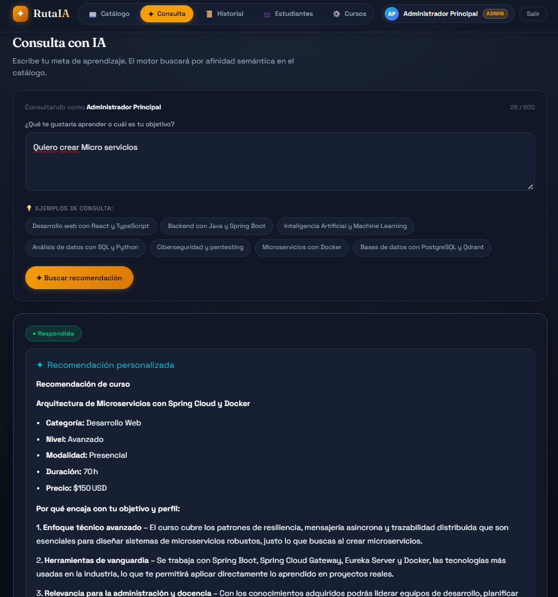
<!-- Como generar esta imagen:
1. Iniciar la aplicacion web RutaIA en el navegador (ejemplo: http://127.0.0.1:5500/rutaia-frontend/index.html).
2. Iniciar sesion con un usuario de prueba (ej: carlos.mendoza@universidad.edu / Estudiante123!).
3. Ejecutar una consulta en la seccion 'Consulta Inteligente' para que se muestren la recomendacion generada y las fuentes recuperadas.
4. Tomar una captura de pantalla nitida de la vista completa y guardarla en 'imgs/interfaz_usuario.png'.
-->

### Evidencias de consultas inteligentes

A continuación se muestran ejemplos de la experiencia de consulta y recomendación generada por RutaIA:

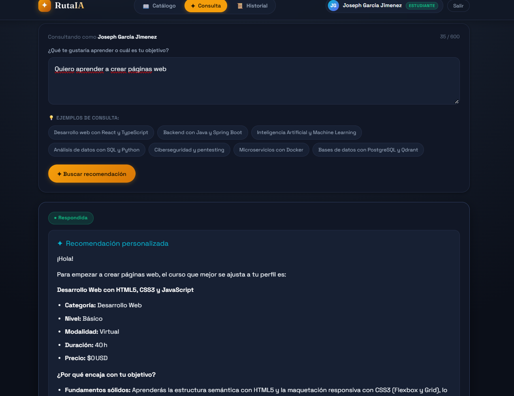
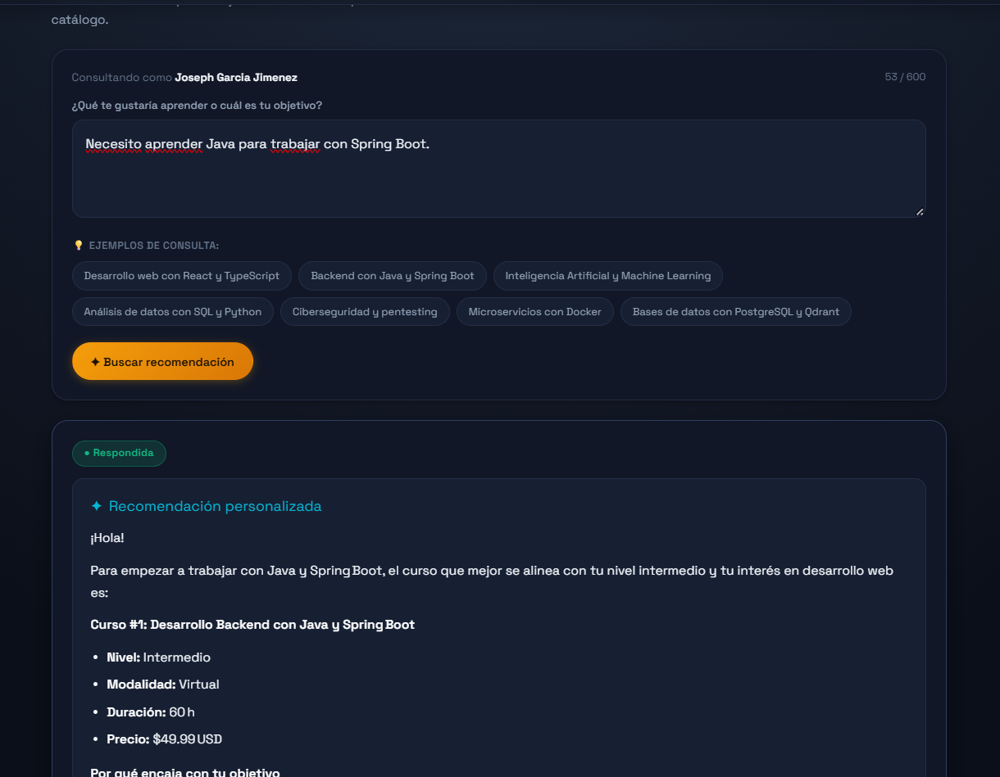
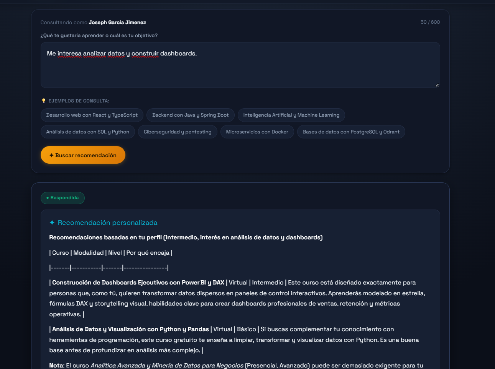
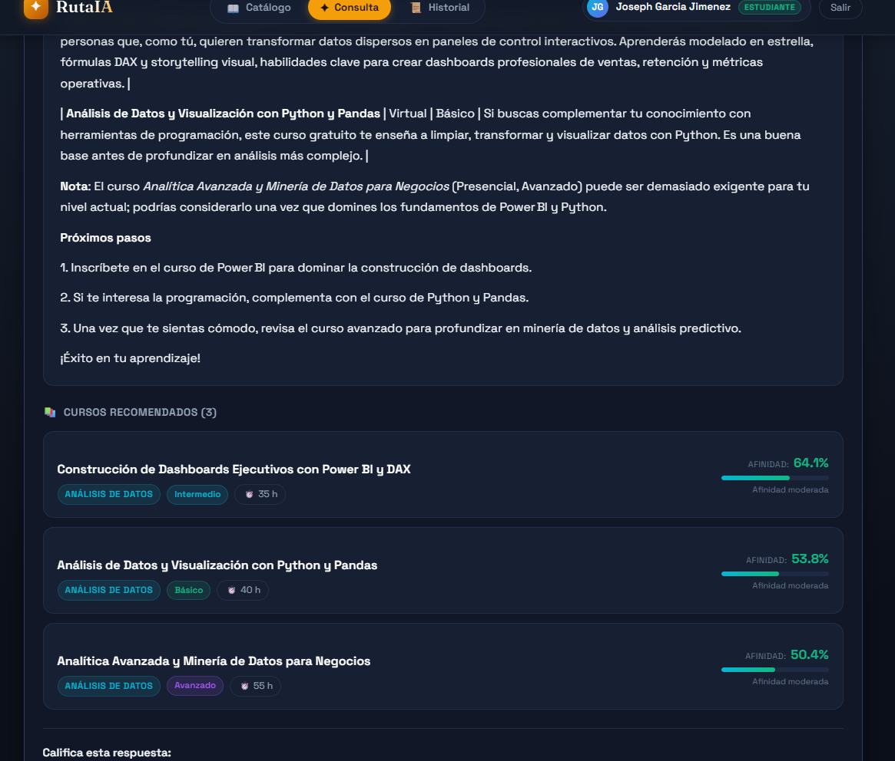
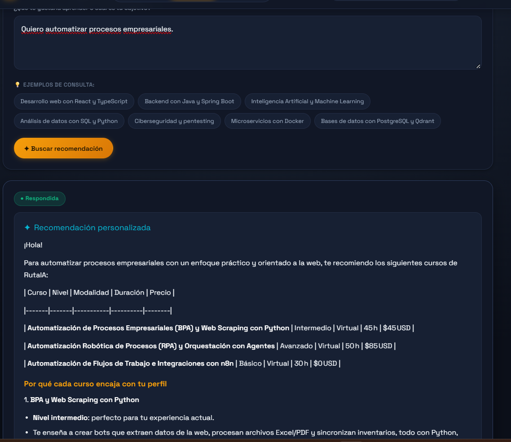
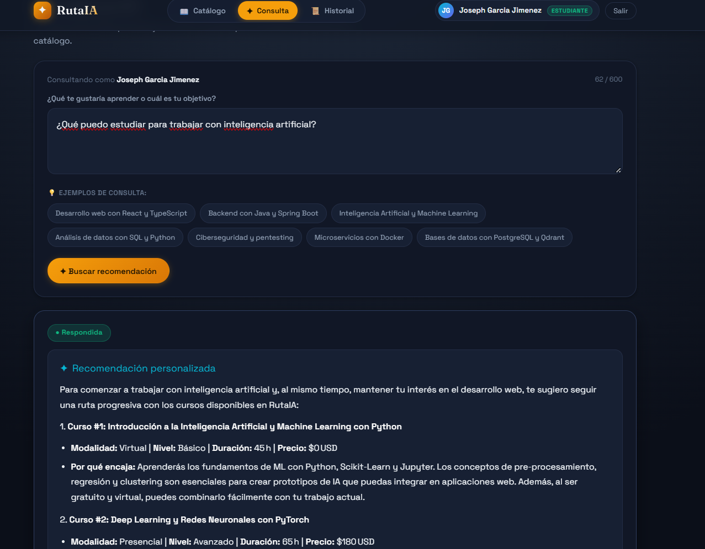
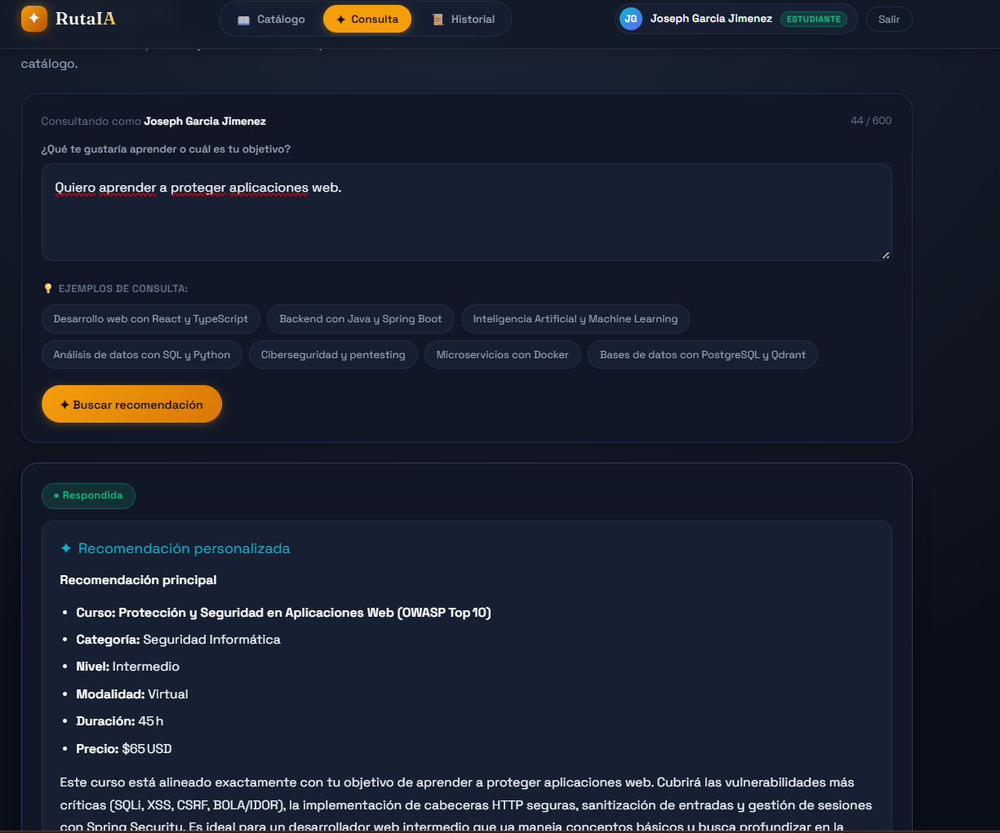
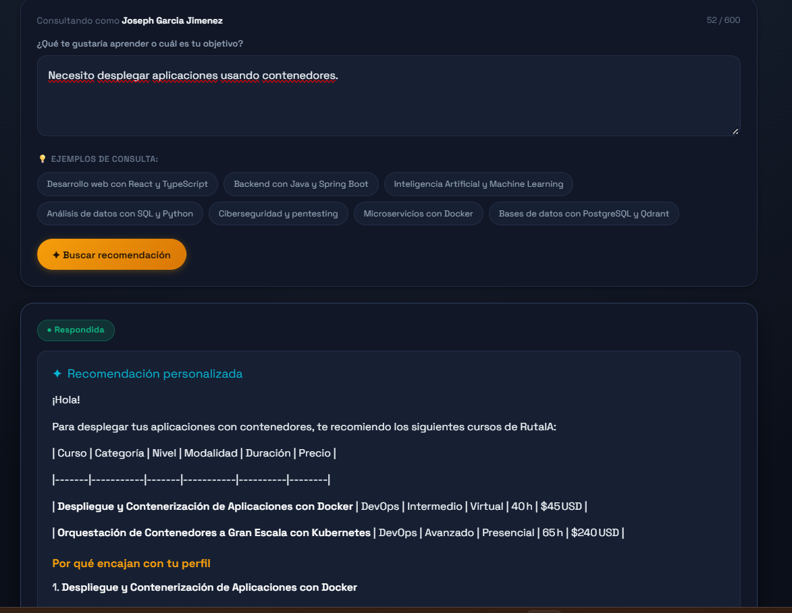
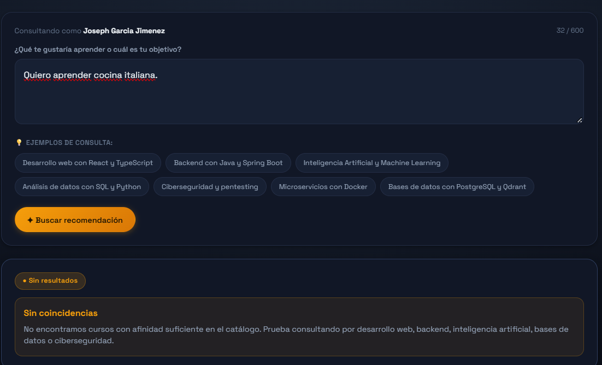
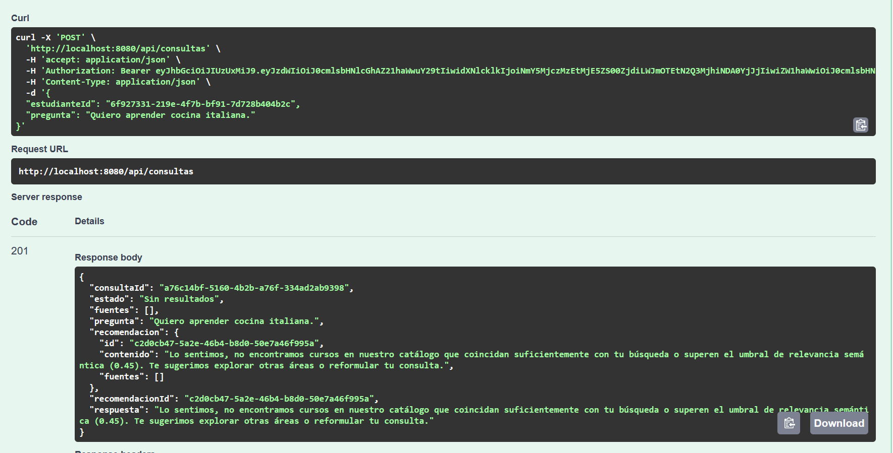
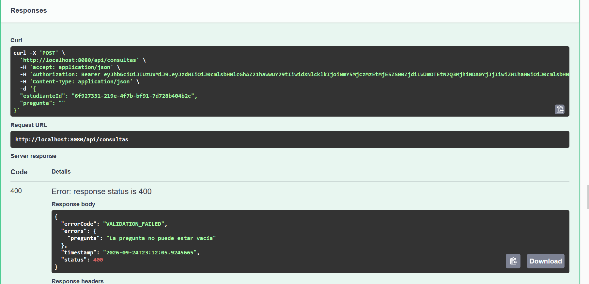
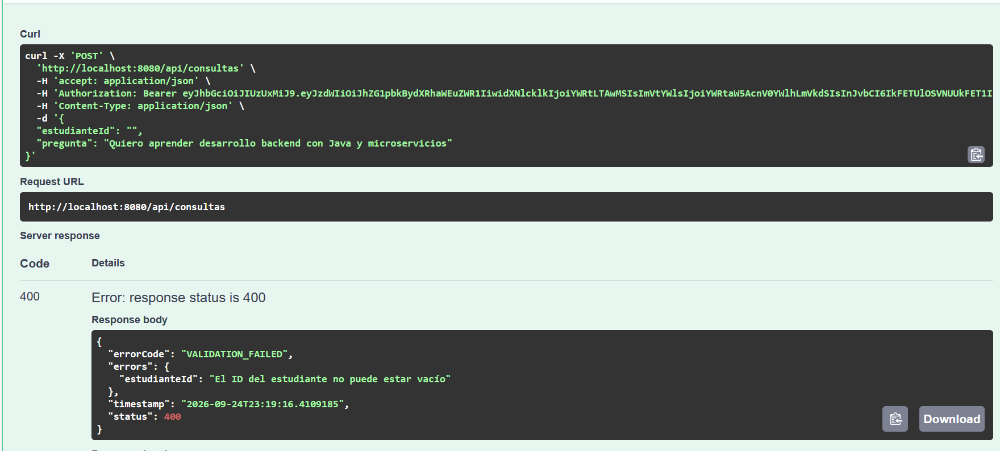

---

## 5. Importación y Configuración de Workflows en n8n

Para que el backend pueda comunicarse con el flujo de inteligencia artificial y mantener actualizado el vector store, es necesario importar los dos flujos incluidos en la carpeta `n8n/`. Consulte la guía completa en [n8n/README.md](n8n/README.md).

1. **Acceder a n8n:** Ingresar a `http://localhost:5678`.
2. **Importar Flujos:**
   - Seleccionar **Workflows** -> **Add Workflow** -> **Import from File**.
   - Cargar `n8n/rag_query_workflow.json` (Pipeline RAG sincrónico).
   - Cargar `n8n/curso_sync_workflow.json` (Sincronización de catálogo hacia Qdrant).
3. **Configurar Credencial de OpenRouter:**
   - En los nodos HTTP de OpenRouter, asignar una credencial de tipo *Header Auth*:
     - **Header Name:** `Authorization`
     - **Header Value:** `Bearer TU_API_KEY_DE_OPENROUTER`
4. **Activar los Flujos:**
   - Cambiar el interruptor de cada flujo a **Active** para habilitar la escucha de los webhooks en `/webhook/rag-query` y `/webhook/curso-sync`.

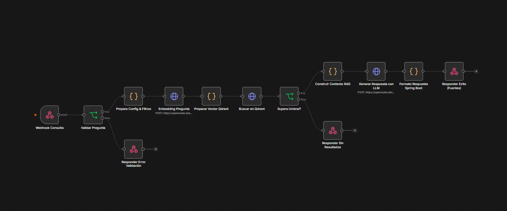
<!-- Como generar esta imagen:
1. Abrir n8n en http://localhost:5678 y entrar en el flujo 'RutaIA - Pipeline RAG de Consultas'.
2. Ajustar el zoom del canvas para que se visualicen con claridad todos los nodos (Webhook -> Validar -> Config -> Embedding -> Qdrant -> Contexto -> LLM -> Respuesta).
3. Tomar una captura de pantalla del canvas y guardarla en 'imgs/flujo_rag_n8n.png'.
-->

---

## 6. Endpoints Principales y Ejemplos de Uso

Todos los endpoints protegidos requieren el encabezado HTTP:
`Authorization: Bearer <TOKEN_JWT>`

### Resumen de Endpoints por Módulo

| Módulo | Método | Endpoint | Permiso Requerido | Descripción |
| :--- | :---: | :--- | :---: | :--- |
| **Autenticación** | `POST` | `/api/auth/login` | Público | Autentica usuario y emite token JWT |
| **Autenticación** | `POST` | `/api/auth/register/estudiante` | Público | Registro de estudiantes |
| **Autenticación** | `POST` | `/api/auth/register/admin` | Público | Registro de administradores con clave |
| **Autenticación** | `GET` | `/api/auth/me` | Estudiante / Admin | Perfil del usuario autenticado |
| **Consultas RAG** | `POST` | `/api/consultas` | Estudiante / Admin | Procesa consulta académica vía RAG |
| **Consultas RAG** | `GET` | `/api/consultas/historial` | Estudiante / Admin | Historial del estudiante autenticado |
| **Consultas RAG** | `GET` | `/api/consultas/historial/{estudianteId}` | Estudiante (propio) / Admin | Historial por ID de estudiante |
| **Calificaciones** | `POST` | `/api/calificaciones` | Estudiante / Admin | Califica recomendación (1 a 5) |
| **Cursos** | `GET` | `/api/cursos` | Público | Catálogo con filtros opcionales |
| **Cursos** | `POST` | `/api/cursos` | Solo Administrador | Crea curso y sincroniza en Qdrant |
| **Cursos** | `PUT` | `/api/cursos/{id}` | Solo Administrador | Modifica curso y actualiza vector |
| **Cursos** | `PATCH` | `/api/cursos/{id}/desactivar` | Solo Administrador | Baja lógica y exclusión de Qdrant |
| **Estudiantes** | `GET` | `/api/estudiantes` | Solo Administrador | Lista todos los estudiantes |
| **Estudiantes** | `GET` | `/api/estudiantes/{id}` | Estudiante (propio) / Admin | Perfil individual de estudiante |
| **Estadísticas** | `GET` | `/api/estadisticas` | Estudiante / Admin | Métricas globales del sistema |

---

### Ejemplos de Uso con cURL: Flujo del Estudiante (Student)

#### 1. Iniciar Sesión como Estudiante
Permite obtener el token JWT firmado con rol `ESTUDIANTE`:
```bash
curl -X POST http://localhost:8080/api/auth/login \
  -H "Content-Type: application/json" \
  -d '{
    "identificador": "carlos.mendoza@universidad.edu",
    "password": "password123"
  }'
```

#### 2. Consultar Perfil del Usuario Autenticado
Valida la identidad del estudiante a partir del token:
```bash
curl -X GET http://localhost:8080/api/auth/me \
  -H "Authorization: Bearer <TOKEN_JWT_ESTUDIANTE>"
```

#### 3. Explorar Catálogo de Cursos con Filtros Opcionales
Permite buscar cursos activos por identificador de categoría y nivel:
```bash
curl -X GET "http://localhost:8080/api/cursos?categoriaId=cat-001&nivelId=niv-001"
```

#### 4. Realizar Consulta Académica Inteligente (RAG)
El identificador del estudiante se extrae de forma obligatoria desde el JWT en el servidor para impedir la suplantación de identidad:
```bash
curl -X POST http://localhost:8080/api/consultas \
  -H "Content-Type: application/json" \
  -H "Authorization: Bearer <TOKEN_JWT_ESTUDIANTE>" \
  -d '{
    "pregunta": "Deseo aprender a construir aplicaciones web completas con JavaScript y bases de datos"
  }'
```

#### 5. Consultar Historial Personal de Consultas
Recupera las consultas, recomendaciones emitidas y cursos recuperados para el estudiante en sesión:
```bash
curl -X GET http://localhost:8080/api/consultas/historial \
  -H "Authorization: Bearer <TOKEN_JWT_ESTUDIANTE>"
```

#### 6. Calificar una Recomendación Recibida
Registra una evaluación de pertinencia (de 1 a 5) vinculada a la recomendación y al estudiante:
```bash
curl -X POST http://localhost:8080/api/calificaciones \
  -H "Content-Type: application/json" \
  -H "Authorization: Bearer <TOKEN_JWT_ESTUDIANTE>" \
  -d '{
    "recomendacionId": "rec-001",
    "puntuacion": 5,
    "comentario": "Excelente respuesta pedagógica, aclaró mi ruta formativa."
  }'
```

#### 7. Restricción de Seguridad: Intento de Operación Administrativa por Estudiante (403)
Demuestra que un usuario con rol `ESTUDIANTE` no tiene privilegios para crear cursos en el catálogo:
```bash
curl -X POST http://localhost:8080/api/cursos \
  -H "Content-Type: application/json" \
  -H "Authorization: Bearer <TOKEN_JWT_ESTUDIANTE>" \
  -d '{
    "nombre": "Curso No Permitido",
    "descripcion": "Intento de alta sin rol administrativo",
    "categoriaId": "cat-001",
    "nivelId": "niv-001",
    "duracion": 20,
    "modalidad": "Virtual",
    "precio": 0.00
  }'
```
Respuesta esperada: `HTTP 403 Forbidden` con mensaje `"Acceso denegado: permisos insuficientes"`.

---

### Ejemplos de Uso con cURL: Flujo del Administrador (Admin)

#### 1. Iniciar Sesión como Administrador
Permite obtener el token JWT firmado con rol `ADMINISTRADOR`:
```bash
curl -X POST http://localhost:8080/api/auth/login \
  -H "Content-Type: application/json" \
  -d '{
    "identificador": "admin@rutaia.edu",
    "password": "admin123"
  }'
```

#### 2. Consultar Perfil de Administrador
```bash
curl -X GET http://localhost:8080/api/auth/me \
  -H "Authorization: Bearer <TOKEN_JWT_ADMINISTRADOR>"
```

#### 3. Crear Nuevo Curso en el Catálogo (Sincronización Automática con Qdrant)
Persiste el curso en MySQL y dispara el webhook asíncrono en n8n para vectorizar y almacenar en Qdrant:
```bash
curl -X POST http://localhost:8080/api/cursos \
  -H "Content-Type: application/json" \
  -H "Authorization: Bearer <TOKEN_JWT_ADMINISTRADOR>" \
  -d '{
    "nombre": "Arquitectura de Software con Microservicios",
    "descripcion": "Diseño de sistemas distribuidos con Spring Cloud, Kafka y Docker. Prerrequisitos: Java intermedio.",
    "categoriaId": "cat-001",
    "nivelId": "niv-003",
    "duracion": 40,
    "modalidad": "Virtual",
    "precio": 120.00
  }'
```

#### 4. Modificar Información de un Curso Existente
Actualiza los datos académicos en MySQL y re-vectoriza el punto en Qdrant:
```bash
curl -X PUT http://localhost:8080/api/cursos/c0000001-0000-4000-8000-000000000001 \
  -H "Content-Type: application/json" \
  -H "Authorization: Bearer <TOKEN_JWT_ADMINISTRADOR>" \
  -d '{
    "nombre": "Desarrollo Web Full Stack con React y Spring Boot",
    "descripcion": "Construcción integral de soluciones web modernas con frontend SPA y API REST. Prerrequisitos: Fundamentos de programación.",
    "categoriaId": "cat-001",
    "nivelId": "niv-002",
    "duracion": 45,
    "modalidad": "Virtual",
    "precio": 99.99
  }'
```

#### 5. Desactivar Curso (Baja Lógica y Exclusión de Qdrant)
Cambia el estado a inactivo en MySQL y marca o elimina el vector en Qdrant para excluirlo de futuras consultas RAG:
```bash
curl -X PATCH http://localhost:8080/api/cursos/c0000001-0000-4000-8000-000000000001/desactivar \
  -H "Authorization: Bearer <TOKEN_JWT_ADMINISTRADOR>"
```

#### 6. Listar Todos los Estudiantes Registrados
Operación administrativa exclusiva para gestión y seguimiento de usuarios:
```bash
curl -X GET http://localhost:8080/api/estudiantes \
  -H "Authorization: Bearer <TOKEN_JWT_ADMINISTRADOR>"
```

#### 7. Crear Estudiante desde el Panel Administrativo
```bash
curl -X POST http://localhost:8080/api/estudiantes \
  -H "Content-Type: application/json" \
  -H "Authorization: Bearer <TOKEN_JWT_ADMINISTRADOR>" \
  -d '{
    "nombre": "Ana Lucia Torres",
    "email": "ana.torres@universidad.edu",
    "password": "TemporalPassword123!",
    "nivelExperiencia": "Intermedio",
    "areaInteres": "Inteligencia Artificial"
  }'
```

#### 8. Auditar Historial de Consultas de Cualquier Estudiante
El administrador puede inspeccionar el historial completo de cualquier alumno mediante su identificador:
```bash
curl -X GET http://localhost:8080/api/consultas/historial/est-002 \
  -H "Authorization: Bearer <TOKEN_JWT_ADMINISTRADOR>"
```

#### 9. Consultar Métricas y Estadísticas Institucionales
Recupera el volumen total de consultas, porcentaje de efectividad, promedios de calificación y categorías más demandadas:
```bash
curl -X GET http://localhost:8080/api/estadisticas \
  -H "Authorization: Bearer <TOKEN_JWT_ADMINISTRADOR>"
```

#### 10. Eliminar Cuenta de Estudiante
Elimina la cuenta y perfil de un estudiante específico del sistema institucional:
```bash
curl -X DELETE http://localhost:8080/api/estudiantes/est-010 \
  -H "Authorization: Bearer <TOKEN_JWT_ADMINISTRADOR>"
```

---

## 7. Colección de Pruebas en Postman

El proyecto incluye una colección completa de Postman v2.1.0 y su correspondiente entorno para verificar todos los escenarios funcionales y de seguridad:

- **Archivo de Colección:** `postman/RutaIA_API_Collection.json`
- **Archivo de Entorno:** `postman/RutaIA_Environment.json`

### Importación y Ejecución
1. Abrir Postman y seleccionar **Import**.
2. Arrastrar ambos archivos `.json` ubicados en la carpeta `postman/`.
3. Seleccionar el entorno **RutaIA Environment**.
4. Ejecutar la colección utilizando el **Collection Runner** de Postman para validar las aserciones automáticas (`pm.test`) en cada endpoint.

---

## 8. Errores Conocidos y Estrategias de Mitigación

1. **Agotamiento de cuota o latencia en el proveedor externo de IA (OpenRouter):**
   - *Comportamiento:* Si OpenRouter experimenta sobrecarga o la API key carece de créditos, la llamada HTTP en n8n puede agotarse por tiempo de espera.
   - *Mitigación:* `ConsultaServiceImpl` implementa un bloque de contingencia defensivo que captura excepciones de red con n8n, registra la consulta con estado `Error`, persiste un mensaje explicativo y retorna una respuesta controlada al usuario sin interrumpir la disponibilidad de la aplicación.

2. **Consultas fuera del dominio temático del catálogo:**
   - *Comportamiento:* Si un estudiante pregunta por temas no cubiertos en la oferta institucional (ejemplo: gastronomía o medicina), Qdrant no encontrará vectores que superen el umbral de similitud coseno de 0.45.
   - *Mitigación:* El nodo condicional en `rag_query_workflow.json` evalúa si el conjunto de fuentes es vacío o no supera el umbral. De ser así, responde de inmediato con estado `Sin resultados` y un mensaje orientativo, evitando alucinaciones del modelo y costos de inferencia innecesarios.

3. **Capacidad del contenido de recomendación en base de datos relacional:**
   - *Comportamiento:* Respuestas generadas por modelos de lenguaje masivo que excedan la longitud de la columna en base de datos provocarían un error de desbordamiento en MySQL.
   - *Mitigación:* Se implementó un truncamiento defensivo a nivel de software en `ConsultaServiceImpl` (`recortarTextoDefensivo`), garantizando que ningún texto exceda los 1995 caracteres antes de su persistencia.

4. **Políticas de CORS al abrir el cliente directamente desde el sistema de archivos:**
   - *Comportamiento:* Abrir `rutaia-frontend/index.html` mediante el protocolo `file://` en navegadores como Google Chrome puede bloquear solicitudes fetch hacia `http://localhost:8080` debido a la política de origen cruzado de archivos locales.
   - *Mitigación:* Se configuró `CorsConfig` en Spring Boot con soporte para patrones de origen flexibles. Se recomienda ejecutar el frontend a través de un servidor HTTP local (como Live Server o Python `http.server`).
